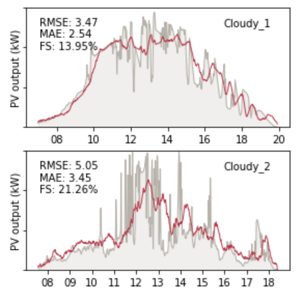
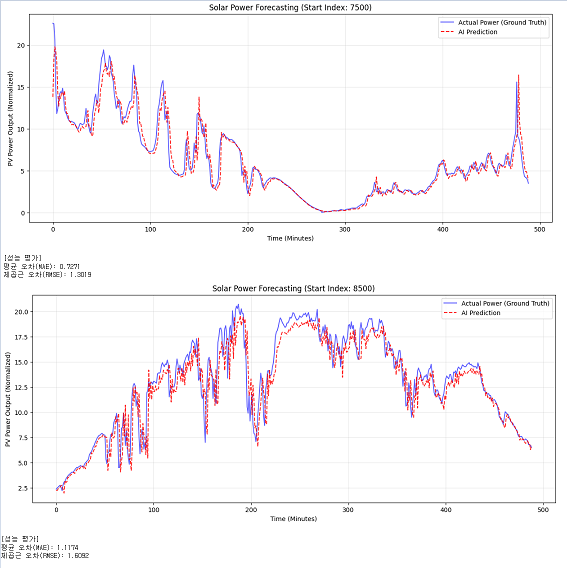

# ☀️ Deep Learning-based Solar PV Nowcasting System
> **SKIPP'D 데이터셋과 CNN-LSTM 하이브리드 모델을 활용한 단기 태양광 발전량 예측 시스템**


## 📖 프로젝트 개요 (Overview)
태양광 발전은 기상 상황, 특히 구름의 이동에 따라 발전량이 급격히 변동하는 간헐성 문제를 가지고 있습니다. 본 프로젝트는 이러한 문제를 해결하기 위해 **어안 렌즈(Fish-eye lens)**로 촬영된 하늘 영상을 딥러닝으로 분석하여, **초단기(15분 후) 태양광 발전량(PV Output)을 정밀하게 예측(Nowcasting)**하는 시스템을 구현하였습니다.

기존의 단순 이미지 분석(CNN) 방식을 넘어, **시계열적 특성(구름의 이동 벡터)을 반영할 수 있는 LSTM 레이어를 결합**하여 예측 정확도를 개선하였습니다.

## 🛠 시스템 구조 (Architecture)
본 연구에서 제안하는 **Spatio-Temporal Hybrid Model**의 구조는 다음과 같습니다.

1.  **Input**: 연속된 하늘 영상 (Sky Images Sequence)
2.  **Feature Extraction (CNN)**: 각 프레임에서 구름의 공간적 특징(모양, 밀도) 추출
3.  **Temporal Analysis (LSTM)**: 추출된 특징들의 시간적 흐름(이동 방향, 속도) 학습
4.  **Output**: 미래 시점의 예상 발전량 (kW)


## 📂 폴더 구조 (Directory Structure)
```text
Solar-Nowcasting-Capstone/
├── data/                  # 데이터셋 (용량 문제로 샘플만 포함)
├── notebooks/             # 주피터 노트북 소스코드
│   ├── 01_Data_Loader.ipynb    # SKIPP'D HDF5 데이터 로드 및 시각화
│   └── 02_Model_Training.ipynb # CNN-LSTM 모델 학습 및 추론 (Main)
├── results/               # 실험 결과 그래프 및 로그
├── README.md              # 프로젝트 설명서
└── requirements.txt       # 필요 라이브러리 명세
```

## 💻 핵심 기술 (Tech Stack)
* **Language**: Python
* **Deep Learning**: TensorFlow, Keras (CNN, LSTM)
* **Data Processing**: NumPy, Pandas, H5py
* **Environment**: Google Colab Pro

## 📊 데이터셋 (Dataset)
본 프로젝트는 **Stanford University**에서 공개한 **SKIPP'D (SKy Images and Photovoltaic Power Generation Dataset)** 벤치마크 데이터를 사용하였습니다.
* **입력 데이터**: 1분 간격의 고해상도 하늘 이미지
* **타겟 데이터**: 동시간대 실제 태양광 발전량 수치
* *Note: 원본 데이터는 용량이 크므로 Stanford PURL에서 별도 다운로드가 필요합니다.*
* [Stanford SKIPP'D Dataset 다운로드](https://purl.stanford.edu/dj417rh1007)

## 🚀 실험 결과 (Experimental Results)
제안된 CNN-LSTM 모델을 적용한 결과, 기존 베이스라인 모델 대비 시계열 예측 성능이 향상됨을 확인하였습니다.

| Metric | CNN Baseline | **Proposed (CNN-LSTM)** |
|:---:|:---:|:---:|
| **RMSE** | *4.27* | **2.65** (개선) |
| **MAE** | *2.95* | **1.52** (개선) |

<p align="center">
  
  
</p>

* **왼쪽**: CNN 모델 예측 결과
* **오른쪽**: CNN-LSTM 하이브리드 모델 예측 결과

## 🔧 실행 방법 (How to Run)
1.  이 저장소를 Clone 합니다.
    ```bash
    git clone [https://github.com/Your-ID/Solar-Nowcasting-Capstone.git](https://github.com/Your-ID/Solar-Nowcasting-Capstone.git)
    ```
2.  Google Colab에서 `notebooks/02_Model_Training.ipynb`를 엽니다.
3.  Google Drive에 SKIPP'D 데이터셋(`files.hdf5`)을 업로드하고 경로를 지정합니다.
4.  전체 셀을 실행하여 학습 및 예측 결과를 확인합니다.

## 🔗 참고 문헌 (References)
* *Nie, Y., et al. "SKIPP'D: A SKy Images and Photovoltaic Power Generation Dataset for short-term solar forecasting." Solar Energy (2023).*

---
**Author**: [본인 이름/학번] (Electrical Engineering, OO Univ.)
